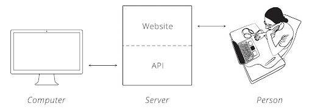

```{r setup, include=FALSE}

knitr::opts_chunk$set(echo = FALSE)

```


## Our agenda for today:

- Definition of web APIs
- How web APIs work and why are they important
- A quick demonstration on how to do a web API


# Introduction to API {.bigger}

## Defining web APIs 

*What is a web API?*\
API stands for 'Application Programming Interface’. It is a place where computers talk to each other. Web APIs allow communication between: a client, your R script  and a server, which hosts a website. Web APIs often are organized hierarchically, with different levels of information that can be accessed. s

*What do web APIs do?*\
- Makes it easier for a computer to interact with data on server
- Allows access to ‘hidden’ part of website




## What are APIs good for?

When you need data from website in a programmatic manner:

- A lot of data

- Data gets updated constantly (weather, price of gold) 

**What are their strengths?**\
Unlike in webscraping, there is a structured way to access data in APIs. 
Data is obtained in a standardized format.

**What are their disadvantages?**\
You need to know how to ask the right questions in order to get the answers that you want. To do that, you need to know the API very well, and that might be a challenge!
There are multiple system and different ways to do it, depending on how the API was designed


## What is  the logic of APIs?
In order for APIs to be done, computers need a protocol. 
*But what does that mean?*\

It means that a set of rules define how a computer reads a message.  This set of rules is the internet's protocol, also known as HTTP.  

This is also known as a Request-Response Cycle: We can ask the server to do something, and the server will tell us if it can be done or not (Cooksey, 2014) 

## Making Valid Requests
Also, according to Cooksey (2014), to make a valid request, the client needs to include four things:

- URL (Uniform Resource Locator) 

- Method 

- List of Headers 

- Body

## The HTTR Package
`httr` connects your data to a server and organizes it according to your setups. This means that HTTPR helps you to **make a request** to a server. The most frequently used functions in this package are:

-**HEAD():** it returns the headers of your metadata but without the data itself, allowing you to understand your variables without moving everything to your R.

-**GET():** tells the server to get the information from the url into your scripts.

-**POST():** tells the server to create a new resource. 

-**PUT():** tell the server to update a source

-**PATCH():** tells the server to modify a resource.

-**DELETE():** tells the server to delete a resource.

## Code for errors
*How do we check for errors before we continue?*\

When we are building APIs and retrieving the url, it's important to check whether our url is valid and whether it is working before we start retrieving data.

In order to check our url we can run **http_status()**: which will tell us the status of our code and whether our operation was successful or not.

## Most Common Errors

Most APIs documents in websites and platforms will tell you how their error code works, but here is an example of the most common:


## The jsonlite package

```{r}
knitr::include_graphics("./Images/gif_jason.gif")
```


## But now the real jsonlite package

*What does this package do?*\

The `jsonlite` package is a parser, that will tell your API how to read the data being retrieved in the JSON (JavaScript Object Notation) format. `JSON()` converts R objects to JSON language and vice-versa. 


## Now that we know what APIs are, let's work with a quick example:

*Step 1: We will first install the packages that will allow us to work with APIs*\

- install.packages("httr")
- install.packages("jsonlite")
- install.packages("dplyr")

*Step 2: We load these packages using library()*\

- library(httr)
- library(jsonlite)
- library(dplyr)


## Using APIs': An example with TV Maze  

*   TV Maze is a repository of info on TV shows with an API
*   The first thing we do is get link to API from website. 
*   https://www.tvmaze.com/api
*   From documentation, we get specific url to search for shows
*   We search for shows containing the word 'girls'


```{r}
### 1. url we got from documentation, we search for breaking bad
url <- "https://api.tvmaze.com/search/shows?q=girls"

### 2. we retrieve information from this URL, using httr package
retrieved_info <- httr::GET(url) 

### 3. we inspect the contents of what we retrieved
retrieved_info
```


