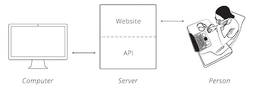
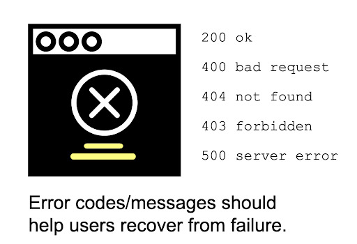

```{r setup, include=FALSE}
# figures formatting setup
options(htmltools.dir.version = FALSE)
library(knitr)
opts_chunk$set(
  comment = "  ",
  prompt = T,
  fig.align="center", #fig.width=6, fig.height=4.5, 
  # out.width="748px", #out.length="520.75px",
  dpi=300, #fig.path='Figs/',
  cache=F, #echo=F, warning=F, message=F
  engine.opts = list(bash = "-l")
  )
## Next hook based on this SO answer: https://stackoverflow.com/a/39025054
knit_hooks$set(
  prompt = function(before, options, envir) {
    options(
      prompt = if (options$engine %in% c('sh','bash')) '$ ' else 'R> ',
      continue = if (options$engine %in% c('sh','bash')) '$ ' else '+ '
      )
})

options(htmltools.dir.version = FALSE)
knitr::opts_chunk$set(echo = FALSE)

library(httr)

```


# Our agenda for today:

<br>

1. Definition of web APIs

2. How web APIs work and why are they important

4. Introduction to HTTR package

5. Introduction to jsonlite package

6. More resources

7. Do it yourself time!

---

name: intro

#Introduction to web APIs

.pull-left[
##What are APIs?


API stands for 'Application Programming Interface’. 

It is a contract on how computers can communicate to each other and between: a client, your R script and a server, which hosts a website. 

- Server: it is like a big computer, capable of storing data or performing different tasks
- Client: companies or you, data analysts `r emo::ji("coder")` 

**Important**: Web APIs are often organized hierarchically, as in a family tree-map format, containing different levels of information that can be accessed by the client. You have to understand the information that you need in order to know the level that it is in.     

]

.pull-right[


[Image by AltexSoft](https://www.altexsoft.com/blog/engineering/travel-and-booking-apis-for-online-travel-and-tourism-service-providers/)<br>

]


---

name: What APIs do?

.pull-left[
**What APIs do?**
- Make it easier for a computer to interact with data on server
- Allows access to ‘hidden’ part of website
- They organize data and codes in a way so developers don't have to start everything from scratch



]


.pull-right[
**Example**
<br>
An easier way to explain what an API is, is to think about a restaurant.
<br>

When you are a client, you go to a restaurant and you have many options of food in the menu (let's say that is the API documentation).
<br>

The client orders the food according to the menu to the waiter, and the waiter send this request to the kitchen (the server). 
<br>

The waiter acts like an API sending the request and bringing back de results - hopefully good food!

]


.footnote[<sup>2</sup> [The image was taken from Brian Cooksey explanation on APIs](https://zapier.com/learn/apis/chapter-1-introduction-to-apis/)<br> <sup>3</sup> [STje kitchen example was taken from Shana Pearlman "What are APIs and how do APIS work? ](https://blogs.mulesoft.com/learn-apis/api-led-connectivity/what-are-apis-how-do-apis-work/)]

---
name: What are APIs good for?

#What are APIs good for?

When you need data from website in a programmatic manner:

- A lot of data
- Data gets updated constantly (weather, price of gold) 

**What are their strengths?**
- Unlike in webscraping, there is a very structured way to access data in APIs. 
- Data is obtained in a standardized format.

**What are their disadvantages?**
- You need to know how to ask the right questions in order to get the answers that you want. To do that, you need to know the API very well, and that might be a challenge!
- There are multiple system and different ways to do it, depending on how the API was designed.

---

name: But, why do companies have APIs?

#But, why do companies have APIs?
<br>

Imagine if everyone decided to retrieve data from a server in an unstructured way. The amount of energy that this would consume would be very high. Now, the company can provide an organized way for clients to retrieve a large amount of data, without overwhelming or crashing their server.

<br>
Moreover, APIs allows for more:

<br>
- **Innovation:** clients have access to data, can develop their own products and solutions
- **Expansion:** APIs can help companies move to different markets or even partner with other companies
- **Variety:** Allows for a large amount of content to be provided in  the internet
- **For people:** APIs are very important for research, people can find solutions to many different problems just by having access to structured dataframes. 


---

name: Still confused on what are APIs?

#Still confused on what are APIs?

.pull-left[
**Let me give you an example:** Many companies use APIs today to allow for their clients to retrieve data and create their own apps, software and solutions. 

<br> 

**Examples:**

<br> 


</div>

]

.pull-right[
**Spotify**: remember when Spotify asks to connect to your friends in Facebook? What is happening there is an API, a website (Spotify) is pulling data from the other website (Facebook). Here, we see that these two websites are **integrated**.

<br> 


</div>

]
---

name: What is  the logic of APIs?

.pull-left[
#What is  the logic of APIs?
In order for APIs to be done, computers need a protocol. 
*But what does that mean?*

It means that a set of rules define how a computer reads a message.  This set of rules is the internet's protocol, also known as **HTTP**.  

This is also known as a Request-Response Cycle: We can ask the server to do something, and the server will tell us if it can be done or not (Cooksey, 2014) 


</div>

]


.pull-right[
## Making Valid Requests
Also, according to Cooksey (2014), to make a valid request, the client needs to include four things:

- **URL (Uniform Resource Locator)**: is a text "address" that specifies where a resource (webpage, video) is located on the internet

- **Method**: the verbs used to talk with the server (ex: `GET()`, `DELETE()`,`POST()`)

- **List of Headers**: will describe the body included in our request

- **Body**: this is the the data itself, the content we are interested in retrieving
]

---

name: The HTTR Package

#The HTTR Package
`httr` connects your data to a server and organizes it according to your setups. This means that HTTR helps you to **make a request** to a server. The most frequently used functions in this package are:

- **HEAD():** returns the headers of your metadata but without the data itself, allowing you to understand your variables before moving everything to your R.

- **GET():** tells the server to get the information from the url into your scripts.

- **POST():** tells the server to create a new resource. 

- **PUT():** tell the server to update a source

- **PATCH():** tells the server to modify a resource.

- **DELETE():** tells the server to delete a resource.


---

name: The tructure of a HTTTP

#The Structure of a HTTP


</div>


---


name: Checking for Errors

.pull-left[

#Checking for Errors

*How do we check for errors before we continue?*

When we are building APIs and retrieving the url, it's important to check whether our url is valid and whether it is working before we start retrieving data.

In order to check our url we can run **http_status()**: which will tell us the status of our code and whether our operation was successful or not.

x <- GET("https://api.tvmaze.com/shows/1")
<br>
http_status(x)

```{r}
x <- GET("https://api.tvmaze.com/shows/1")
http_status(x)
```

]
.pull-right[
#Most Common Errors

Most APIs documents in websites and platforms will tell you how their error code works, but here is an example of the most common:


]
---

name:The jAsonlite package

#The jAsonlite package
<br>


```{r}

```

---

name: But now the real `jsonlite` package

#But now the real `jsonlite` package

.pull-left[
 **As we saw before:**
<br>
- computers communicate with one another through a protocol
- they also need a "language" to communicate with each other
- the most common languages used by computers are: XML and JSON (JavaScript Object Notation)
<br>

We recommend using JSON due to its easier usability.
The JSON language is divided in two:
- **Keys**: they represent an attribute of an object
- **Values**: the details of the object

]

.pull-right[
**For example**:
If our object was a cocktail, attributes could be: type of drink, type of alcohol, fruits etc.
<br>
  {"type_of_drink": "alcoholic",
  <br>
  "type_of_alcohol": ["vodka", "tequila", "gin"],
  <br>
  "status": "cold"}
<br>

The `jsonlite` package is a parser, that will tell your API how to read the data being retrieved in the JSONformat.
`fromJSON()` converts R objects to JSON language and vice-verse. 
<br>

*But in which type of data does the `fromJSON()`function transforms our request?*   
<br>

**Simplification** is what this function does to transform the retrieved list into a more specific R data class: simplifyVector, simplifyDataFrame, simplifyMatrix 

] 

---

name: Overall design of an API

#A Recap: Overall design of an API
<br>

- **STEP 1**: Select the URL address from the API you want to do 
 
- **STEP 2**: Make a request using `GET` from the HTTR package: GET(https://api.tvmaze.com/shows)

- **STEP 3**: add a specification to the URL if you want a certain information: GET(https://api.tvmaze.com/shows/1) if you want to see a specific show, use the show's id

- **STEP 4**: add a query if you want to retrieve specific data from a show: GET(https://api.tvmaze.com/singlesearch/shows?q=girls&embed=episodes)

- **STEP 5**: check whether your url is retrieving information correctly with `status(url)` 

- **STEP 6**: you can also see the types of content and data you have using the function `content`: url_data$headers$`content-type` 

- **STEP 7**: after checking that the language is json, translate jsonlite::fromJSON(url)


